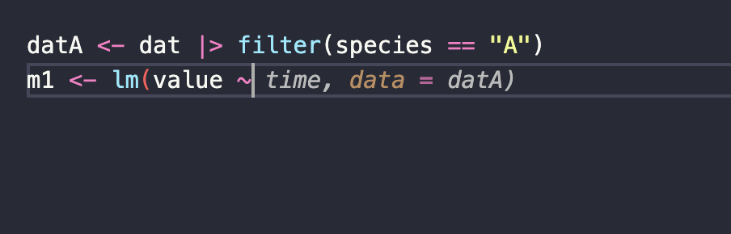
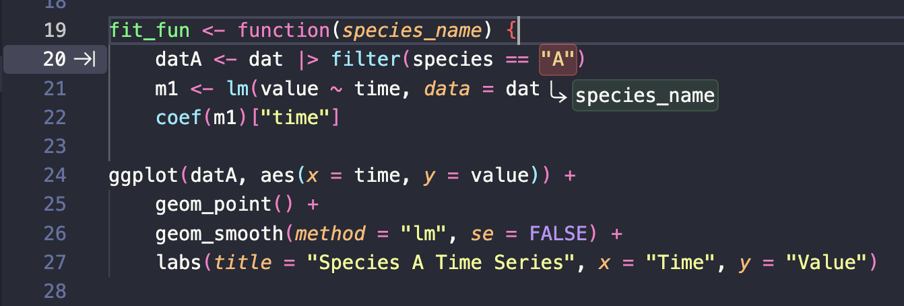
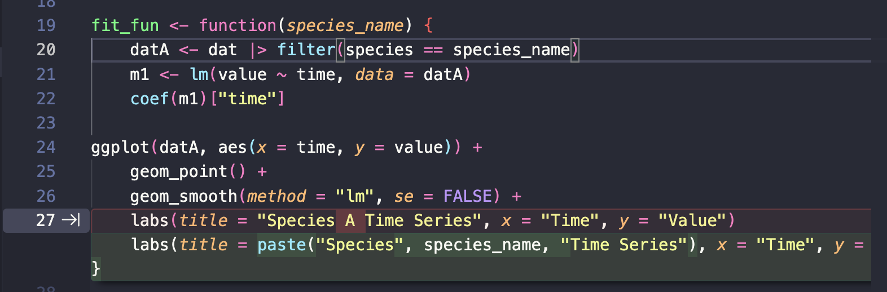
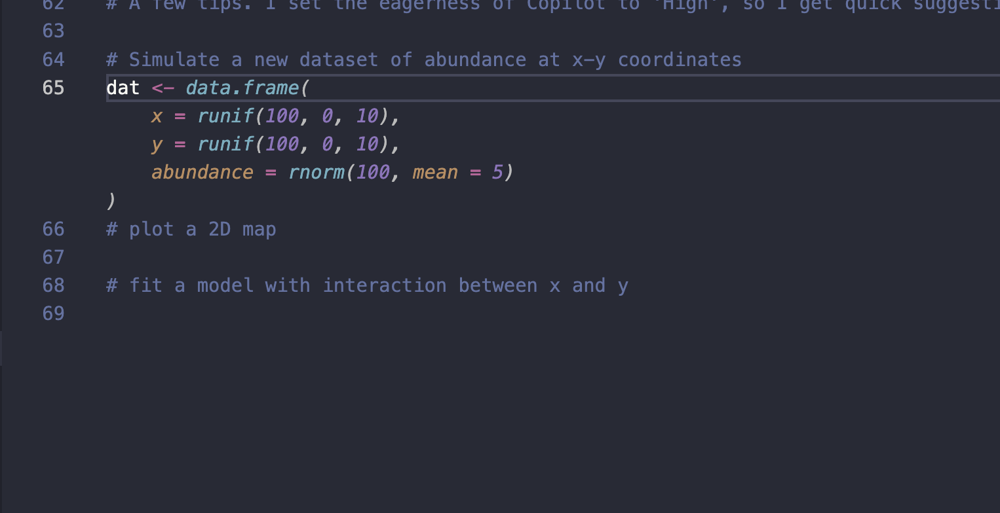
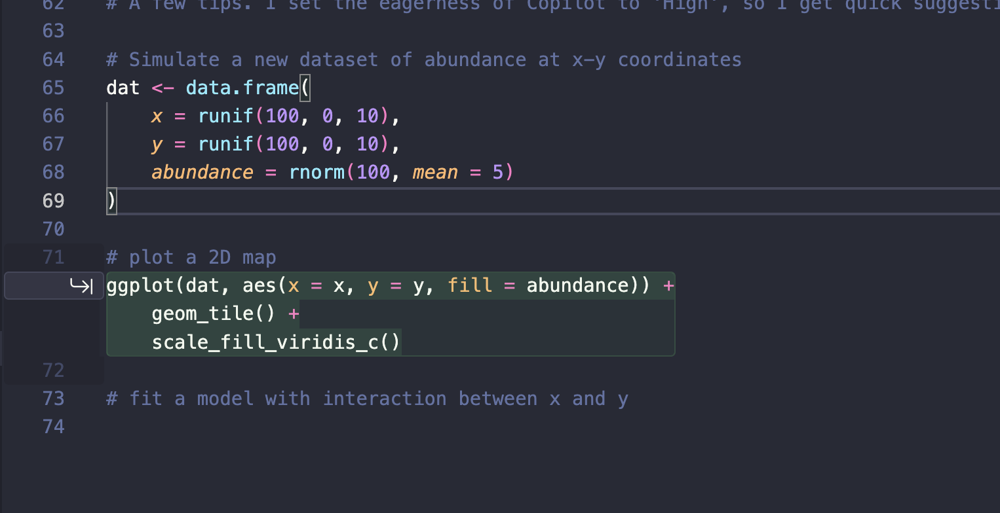
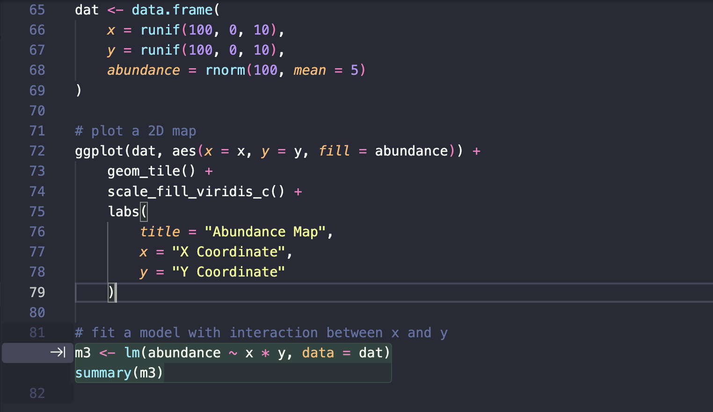

# Next edit suggestions

I'm a big fan of GitHub Copilot's ghost text and next edit suggestions. As a data analyst they give you much more control over the pace and direction of analysis code than a full AI agent. They also let you practice the core skill an agent needs from you: writing a clear specification.

I'll walk through it in R, but the same ideas apply in any language.

## Start with ghost text

Ghost text is the greyed-out completion that appears as you type. Say you have a long-format dataset with timeseries for three species:

```r
library(dplyr)
library(ggplot2)
dat <- data.frame(
    time = rep(1:10, 3),
    species = rep(c("A", "B", "C"), each = 10),
    value = c(rnorm(10, mean = 5), rnorm(10, mean = 10), rnorm(10, mean = 15))
)
```

You want to filter to one species, fit a linear model to its timeseries, pull out the slope, and make a labelled plot. Start typing the code for a single species and ghost text fills in the rest of the line. Here I've typed `m1 <- lm(value ~` and Copilot offers the completion in transparent text (note change in image after the `~`):



Press tab to accept. Working one line at a time, you end up with the code for species A:

```r
datA <- dat |> filter(species == "A")
m1 <- lm(value ~ time, data = datA)
coef(m1)["time"]

ggplot(datA, aes(x = time, y = value)) +
    geom_point() +
    geom_smooth(method = "lm", se = FALSE) +
    labs(
        title = "Species A Time Series",
        x = "Time",
        y = "Value"
    )
```

Notice we're not trying to be general yet. We're developing our ideas for a single case, species A. We know we'll want to generalise later, but we're not worrying about it now. This is the same discipline that makes agents work well: get one concrete case right first, then automate it.

## Turn on next edit suggestions

Next edit suggestions go a step further than ghost text. Instead of completing the line you're on, Copilot predicts the *next change you'll want to make elsewhere* and points you to it.

Click the octocat icon in the bottom right of the VS Code window and turn on **Next Edit Suggestions**. I recommend leaving this off most of the time — it's distracting when it suggests edits you don't want — and switching it on for jobs like this one.

Now click above the species A code and start typing the name of a function to wrap it in. As soon as I write the `fit_fun <- function(species_name)` header, Copilot spots that the hardcoded `"A"` needs to change, and flags it with an arrow in the gutter:



Press tab and it walks you through the edits needed to generalise. It replaces `species == "A"` with `species == species_name`, and further down it rewrites the plot title from the literal `"Species A Time Series"` to a `paste()` call that builds the title from `species_name`:



Tab through each suggestion and you land on a working, generalised function:

```r
fit_fun <- function(species_name) {
    datA <- dat |> filter(species == species_name)
    m1 <- lm(value ~ time, data = datA)
    coef(m1)["time"]

    ggplot(datA, aes(x = time, y = value)) +
        geom_point() +
        geom_smooth(method = "lm", se = FALSE) +
        labs(
            title = paste("Species", species_name, "Time Series"),
            x = "Time",
            y = "Value"
        )
}

fit_fun("A")
```

 The single-species code was the specification and then Copilot did the mechanical work of generalising it. This is a good scaffold for thinking about agentic programming, where you write a clear spec and the agent does the automation.

The big difference from a true agent is that ghost text and next edit don't run your R code and iterate to fix errors. They just predict edits. But that makes them a safe place to build the skills.

## Drive it with comments

You can run the same next-edit approach with text only. Write out a recipe for what you want as comments, then start typing under the first step. Ghost text and next edit take over and help you write the rest.

Here's a simple recipe:

```r
# Simulate a new dataset of abundance at x-y coordinates

# plot a 2D map

# fit a model with interaction between x and y
```

With just the comments in place and the cursor after the simulation, Copilot reads the recipe ahead of it:



Then suggests a next edit suggestion after the following comment:



Keep going and it writes the model for the final step, picking up the interaction from the comment `# fit a model with interaction between x and y`:



Step by step, the finished block writes itself from the recipe.

A few tips. I set Copilot's eagerness to **High** so suggestions come up quickly. Sometimes you need to type the first few characters of a line to kickstart the ghost text.

The clearer and more specific your comments, the closer the suggestions will be to what you actually wanted.

::: {.callout-important title="Challenge" appearance="simple"}
Write three comments describing an analysis you'd like to run — one step per line — then put your cursor under the first and accept the suggestions step by step. Where did the suggestions follow your recipe, and where did they quietly do something different from what you meant?
:::
