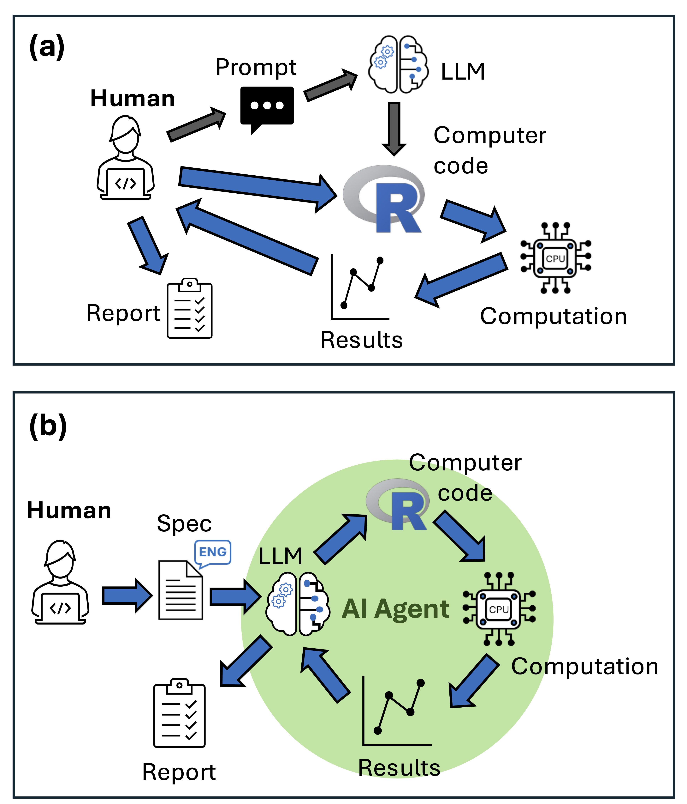

# How agents work

Agents [run tools in a loop](https://simonwillison.net/2025/Sep/18/agents/). That's really the whole concept: the model responds, your software checks whether the response is a request to use a tool (read a file, run a command, edit some text), executes it if so, feeds the result back to the model as part of the conversation, and repeats. The loop ends when the model responds with plain text instead of another tool call. This loop is what makes it possible to automate multi-step data analysis rather than just generate snippets [@jansen_leveraging_2025]. We'll build a toy version of this loop ourselves with `ellmer` in [Section 7](../section-7-api-access/05-make-an-agent.qmd) — once you've built one, "agent" stops feeling like a mysterious term.

Here's roughly how a statistical workflow looks with inline editing (Section 1) versus with an agent doing the same task:

The default behaviour for most agents is to ask your permission before running a tool. That's a safety feature — agents can write and run code, and they can also just get things wrong — so you get a chance to review each step before it happens. In practice, agents work fast enough that *you* become the bottleneck in the loop, not the model.

My own workflow mixes Copilot's editing features with a full agent (Cline or Copilot's agent mode): I start a project by writing a detailed prompt or README (see [Section 3](../section-3-workflows/02-plan-implementation.qmd)), then let the agent scaffold the project and make a first attempt at the code.

Keep a markdown file updated as you go, so the agent stays on topic across sessions — a `README.md` works, and a growing number of agents look specifically for a file called `AGENTS.md` or `CLAUDE.md` for Anthropic's models. If the context in that file goes stale (say, it still mentions a package you've since decided not to use), the agent will keep defaulting back to it — so out-of-date instructions are worse than none.

::: {.callout-important title="Challenge" appearance="simple"}
Look at the docs for whatever agent you have available and see if you can edit or add to the system prompt. What tools are currently listed and is it possible to change these options?
:::
